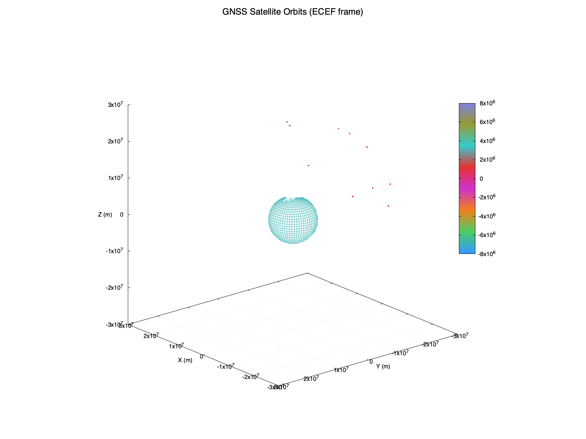
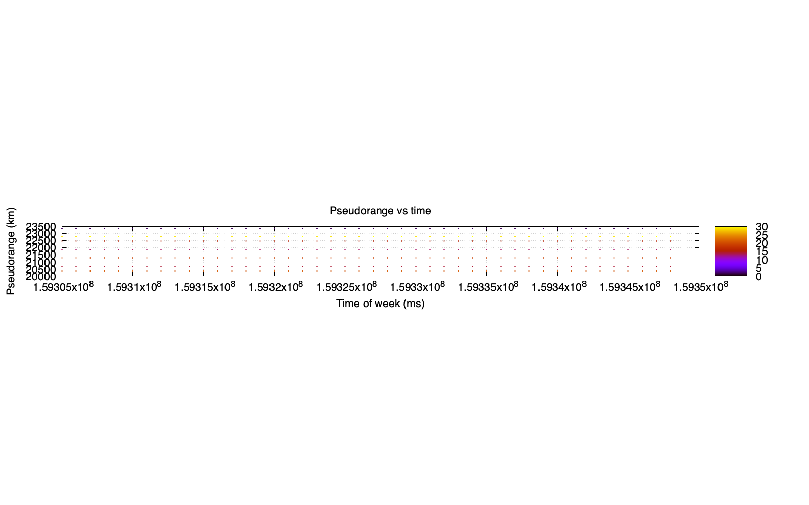

# GNSS L1 Position Resolver

A lightweight **C-based GNSS positioning engine** that parses RTCM observation and ephemeris messages, computes GPS L1 receiver positions in **ECEF** and **geodetic coordinates**, and provides utilities for logging, plotting, and exporting results.

This project is designed as a reference framework for **GNSS engineers, students, and developers** who want to experiment with raw RTCM data and build a basic positioning solution.

---

## ✨ Features

- **RTCM Message Parsing**
  - **RTCM 1002**: Legacy observations (L1 pseudorange + phase).
  - **RTCM 1074 (MSM4)**: Modernized observation messages with multiple cells.
  - **RTCM 1019**: GPS ephemeris (orbital parameters).
- **Positioning Engine**
  - Receiver position estimates in **ECEF (X, Y, Z)**.
  - Conversion to **latitude, longitude, altitude (LLA)** using WGS-84.
  - Epoch-by-epoch logging of receiver track.
- **Input Sources**
  - Parsed RTCM text logs (e.g., from PyRTCM).
  - **TODO**: Raw binary RTCM over serial input.
- **Data Output**
  - Receiver tracks (`receiver_track_ecef.dat`, `receiver_track_geo.dat`).
  - Satellite orbit samples (`sat_track_ecef.dat`, `sat_xyz_km.dat`).
  - Pseudorange vs. epoch time logs.
- **Visualization**
  - Plotting with **Gnuplot**: 2D and 3D orbit/track views.
  - Export to `.kml` for **Google Earth** mapping.

---

## 📂 Project Structure

```
.
├── src/                 # Core C source files
│   ├── main.c           # Entry point
│   ├── app_menu.c       # User menu system
│   ├── app_cleanup.c    # Cleanup routine
│   ├── file_connect.c   # File input utilities
│   ├── serial_connect.c # Serial input (Win/Linux/macOS)
│   ├── df_parser.c      # RTCM message parsing
│   ├── all_plots.c      # Output logging utilities
│   ├── print_utils.c    # ECEF <-> LLA conversion, helpers
│   └── ...
├── include/             # Header files
├── example/             # Sample RTCM log files
├── plots/               # Generated .dat files and gnuplot scripts
└── README.md
```

---

## 🔧 Build Instructions

### Requirements
- **C compiler**:
  - GCC / Clang (Linux, macOS)
  - MSVC or MinGW (Windows)
- **Gnuplot** (for plotting output data)
- **Doxygen** (optional, for documentation)

### Build (macOS/Linux)
```bash
git clone https://github.com/adedolapoadegboye/L1_Position_Algorithm.git
cd L1-Position-Algorithm
make
```

### Run
```bash
./bin/gps_resolver
```

You will see a terminal menu with RTCM input options. Select option 3 and paste the link to the pre-processed file.


---

## 🖥️ Usage

### 1. Run the Application
- Select the RTCM input source:
  - `1` = Serial Port (raw binary) — **not yet implemented**
  - `2` = Live parsed text file — **not yet implemented**
  - `3` = Parsed RTCM text file (recommended)
  - `4` = Exit

### 2. Provide Input File
If you select option **3**, the program will prompt for a parsed log file path.
Press **Enter** to use the default example file in the /example directory.

### 3. Outputs
After processing, you will find files in the `plots/` directory:
- `receiver_track_ecef.dat` — Receiver positions (ECEF, meters).
- `receiver_track_geo.dat` — Receiver positions (Lat/Lon, degrees).
- `receiver_ecef_epoch_km.dat` — Receiver track with epoch indices in kilometers.
- `sat_track_ecef.dat` — Satellite orbit tracks.
- `sat_xyz_km.dat` — Satellite XYZ samples in kilometers.

---

## 📊 Visualization

### Gnuplot
Run included scripts to generate 2D and 3D PNG plots:
```bash
gnuplot plots/plot_2d.gp
```
```bash
gnuplot plots/plot_3d.gp
```

### Example plots:






### Google Earth
Convert geodetic positions to KML:
```bash
awk 'BEGIN{
  print "<?xml version=\"1.0\" encoding=\"UTF-8\"?>";
  print "<kml xmlns=\"http://www.opengis.net/kml/2.2\"><Document>";
  print "<name>Receiver track</name><Placemark><name>Receiver track</name>";
  print "<Style><LineStyle><color>ff0066ff</color><width>3</width></LineStyle></Style>";
  print "<LineString><tessellate>1</tessellate><coordinates>";
}
{ printf "  %.8f,%.8f,0\n", $2, $1 }   # lon,lat,alt
END{
  print "</coordinates></LineString></Placemark></Document></kml>";
}' plots/receiver_track_geo.dat > plots/receiver_track.kml```

Open `receiver_track.kml` saved in /plots in Google Earth to view the path.

---

## 📖 Documentation

This project uses **Doxygen** for code documentation.

Generate HTML docs:
```bash
doxygen Doxyfile
```

The generated documentation will appear in `docs/html/index.html`.

---

## 🛠️ Roadmap

- [ ] Implement live raw RTCM parsing over serial port.
- [ ] Support additional RTCM messages (e.g., 1020, 1045, 1046).
- [ ] Add GLONASS, Galileo, BeiDou support.
- [ ] Extend positioning algorithms (e.g., Weighted Least Squares, EKF).
- [ ] Real-time visualization hooks.

---

## 🤝 Contributing

Contributions are welcome!s
- Fork this repo
- Submit a pull request with clear commits
- Follow Doxygen doc style and consistent formatting

---

## 📜 License

This project is licensed under the **MIT License**.
See the [LICENSE](LICENSE) file for details.
